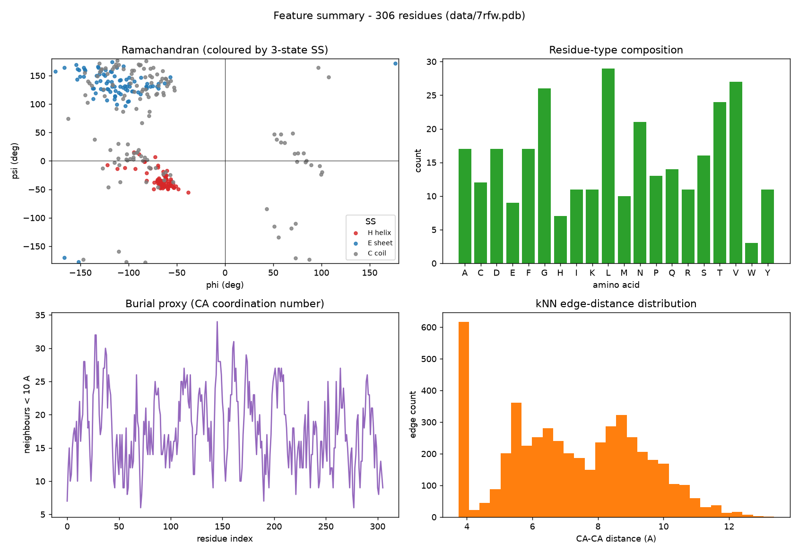

# Protein Feature Pipeline

[](https://github.com/swatizambre/protein-feature-pipeline/actions/workflows/ci.yml)
[](https://www.python.org/downloads/)
[](LICENSE)
[](pyproject.toml)

**Deterministic extract → encode → decode** for structure-based generative learning.

Turn a protein PDB into schema-tagged graph tensors a GNN can consume, then
recover named biological features with a measured round-trip. No model is trained —
this repository is the **representation / data layer**.

**Author:** [Swati Chaudhari](https://github.com/swatizambre) · [@swatizambre](https://github.com/swatizambre)

<p align="center">
  
</p>

<p align="center"><em>7RFW feature summary — Ramachandran, composition, burial, edge distances</em></p>

---

## Highlights

- **Residue geometric graph** — Cα nodes, kNN edges (k = 16, ≤ 22 Å)
- **Fixed schema** — 41-D nodes, 26-D edges, reproducible across proteins
- **Lossless round-trip** on identity, SS, angles, coords, physchem, burial
- **CLI + library + local web console** (FastAPI)
- **Pocket / ligand path** for structure-based drug discovery extras
- **Validated on 7RFW** (SARS-CoV-2 Mpro) with committed demo artifacts

---

## Quick start

```bash
git clone https://github.com/swatizambre/protein-feature-pipeline.git
cd protein-feature-pipeline

python -m venv .venv
# Windows:  .\.venv\Scripts\Activate.ps1
# macOS/Linux: source .venv/bin/activate

pip install -e ".[all]"
protein-features --pdb data/7rfw.pdb
```

Outputs land in `output/pipeline_7rfw/` (`encoded.npz`, `schema.json`,
`validation_report.json`, `features.png`).

```bash
protein-features-web          # → http://127.0.0.1:8000
pytest -q
```

```python
from protein_features import extract, encode, decode, roundtrip_report

protein = extract("data/7rfw.pdb")
encoded = encode(protein)
decoded = decode(encoded)
print(roundtrip_report(protein, decoded, encoded))
```

Full runbook: [`docs/USER_MANUAL.md`](docs/USER_MANUAL.md)

---

## Architecture

```
PDB ──► Extract ──► Encode ──► Decode ──► Validate
          │           │          │
          │           │          └─ named residue fields
          │           └─ tensors + schema (GNN-ready)
          └─ dihedrals · SS · burial · frames · physchem
```

| Stage | Module | Role |
|-------|--------|------|
| Extract | `s1_feature_extraction/` | PDB → per-residue biology & geometry |
| Encode | `s2_encoding/` | Fixed-width nodes + kNN edge graph |
| Decode | `s3_decoding/` | Tensors → interpretable fields |
| Validate | `s4_validation/` | Round-trip consistency report |
| Visualize | `s5_visualization/` | Plots + stepwise EDA |
| Pocket | `s6_pocket_ligand/` | Ligand + binding-pocket graph |
| Web | `web/app.py` | Upload UI + REST API |
| CLI | `main.py` | `protein-features` entry point |

---

## Representation

The protein is modeled as a **residue-level geometric graph** (ProteinMPNN / GVP granularity):

| | Nodes | Edges |
|---|--------|--------|
| **Anchor** | Cα | k = 16 nearest neighbours ≤ 22 Å |
| **Width** | 41-D | 26-D |
| **Contents** | AA one-hot, physchem, SS, φ/ψ/ω (sin/cos/mask), burial | RBF distance, sequence gap, same-chain, relative orientation |

**Why this design**

1. SE(3)-stable channels (distances, dihedrals, relative frames) plus raw coords for equivariant models  
2. Smooth encodings — RBF distances; circular (sin, cos) angles  
3. One-hots for categorical heads (residue type, SS)  
4. Local graph — O(N·k) edges, not all-pairs  

<details>
<summary><strong>Node feature layout (41-D)</strong></summary>

| Block | Dims | Contents |
|-------|------|----------|
| Residue type | 21 | 20 AA + UNK |
| Physicochemical | 7 | hydropathy, charge, volume, polar, aromatic, H-bond donor/acceptor |
| Secondary structure | 3 | helix / strand / coil |
| Backbone dihedrals | 9 | φ, ψ, ω as (sin, cos, mask) |
| Burial | 1 | #Cα within 10 Å |

</details>

<details>
<summary><strong>Edge feature layout (26-D)</strong></summary>

| Block | Dims | Contents |
|-------|------|----------|
| Distance | 16 | Gaussian RBF (0–22 Å) |
| Sequence separation | 1 | signed log residue-index gap |
| Same chain | 1 | binary |
| Relative orientation | 8 | local-frame direction (3) + quaternion (4) + mask (1) |

</details>

---

## Encode / decode contract

```python
EncodedProtein = {
  "node_features": float32 (N, 41),
  "coords":        float32 (N, 3),      # Cα, not normalised
  "edge_index":    int64   (2, E),
  "edge_features": float32 (E, 26),
  "edge_dist":     float32 (E,),        # raw Å
  "schema":        dict,                # column map + hyper-parameters + ids
}
```

| Field | Reconstruction | Fidelity |
|-------|----------------|----------|
| Residue type / SS | `argmax` | exact |
| φ / ψ / ω | `atan2(sin, cos)` | exact |
| Cα / physchem / burial | stored / inverse affine | exact |
| Edge distances (RBF channel) | weighted bin centres | approximate, bounded |

Deterministic: fixed norms, stable kNN ties, schema travels with the tensors.

---

## Results (7RFW)

| Check | Result |
|-------|--------|
| Residues / hetero skipped / chain breaks | 306 / 140 / 0 |
| Neighbour edges | 4,896 |
| Round-trip `passed` | **true** |
| RBF edge-distance mean error | ~0.0002 Å |
| Ligand (pocket path) | nirmatrelvir (`4WI`) → Cys145 |
| Automated tests | 16 passed |

Precomputed artifacts (no install required):

| Path | Contents |
|------|----------|
| [`examples/pipeline_7rfw/`](examples/pipeline_7rfw/) | tensors, schema, validation, plot |
| [`examples/stepwise_7rfw/`](examples/stepwise_7rfw/) | EDA report + figures |
| [`examples/pocket_7rfw/`](examples/pocket_7rfw/) | complex encoding + summary |

---

## Installation

| Mode | Command |
|------|---------|
| Recommended | `pip install -e ".[all]"` |
| Minimal (numpy only) | `pip install -e .` |
| From requirements | `pip install -r requirements.txt` then `pip install -e .` |

**Console scripts:** `protein-features` · `protein-features-analyze` · `protein-features-pocket` · `protein-features-web` · `protein-features-make-test-pdb`

```bash
make install-all && make test
make run analyze pocket    # refresh examples/
```

---

## Web UI & API

```bash
protein-features-web                 # http://127.0.0.1:8000
protein-features-web --auto-port     # next free port if 8000 is busy
```

| Method | Endpoint | Purpose |
|--------|----------|---------|
| `GET` | `/` | Industrial upload console |
| `GET` | `/api/health` | Liveness + upload limit |
| `POST` | `/api/run` | Multipart `file` → full pipeline |
| `GET` | `/api/download/{job_id}/{filename}` | Artifacts |

Interactive docs: `http://127.0.0.1:8000/docs` · Guide: [`docs/USER_MANUAL.md`](docs/USER_MANUAL.md)

---

## Repository layout

```text
protein-feature-pipeline/
├── src/protein_features/
│   ├── main.py                 # CLI
│   ├── core/                   # constants, geometry, io, exceptions
│   ├── s1_feature_extraction/  # extract
│   ├── s2_encoding/            # encode
│   ├── s3_decoding/            # decode
│   ├── s4_validation/          # round-trip
│   ├── s5_visualization/       # plots + EDA
│   ├── s6_pocket_ligand/       # pocket + ligand
│   ├── web/                    # FastAPI (app.py + static UI)
│   └── tools/                  # synthetic PDB
├── examples/                   # committed 7RFW demos
├── data/7rfw.pdb
├── tests/
├── docs/USER_MANUAL.md
└── pyproject.toml
```

---

## Design notes

- **Assumptions:** first NMR model; single altLoc; protein-only on the main path; burial = neighbour count; fixed cross-protein norms  
- **Robust PDBs:** hetero skipped; gap-aware dihedrals; missing backbone masked; non-standard → UNK  
- **Scale:** independent structures; SciPy `cKDTree` when available; cache `.npz`; fixed schema for batching  

---

## License

MIT © [Swati Chaudhari](https://github.com/swatizambre)

---

## Citation

If you use this codec in downstream work, please link the repository:

```text
https://github.com/swatizambre/protein-feature-pipeline
```
