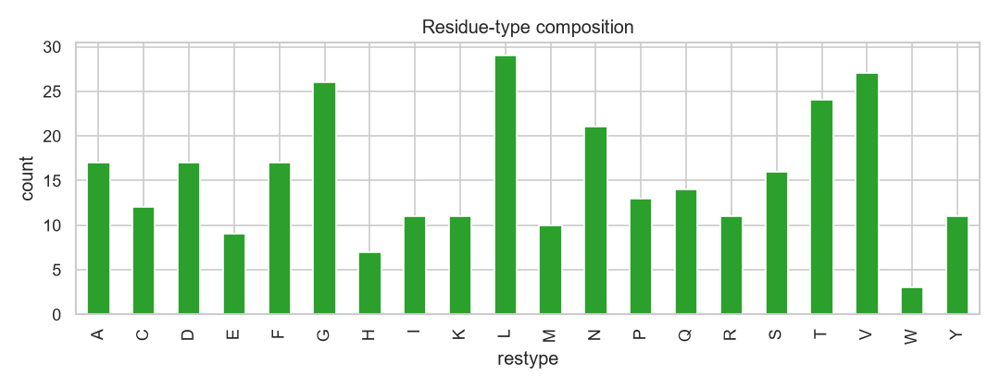
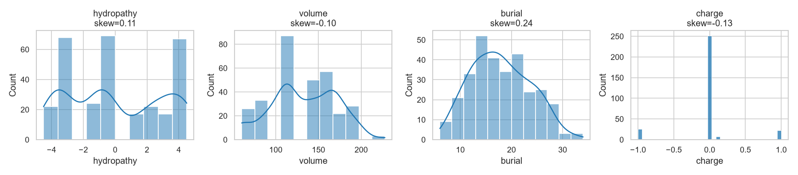
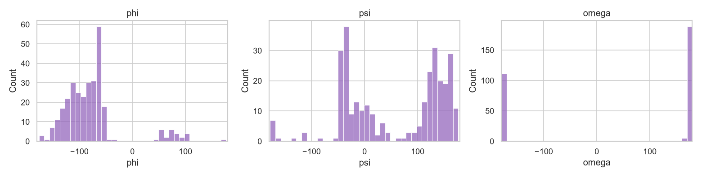
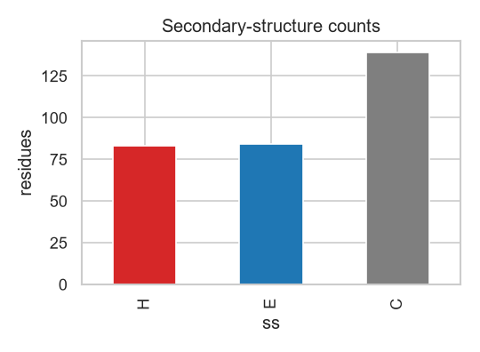
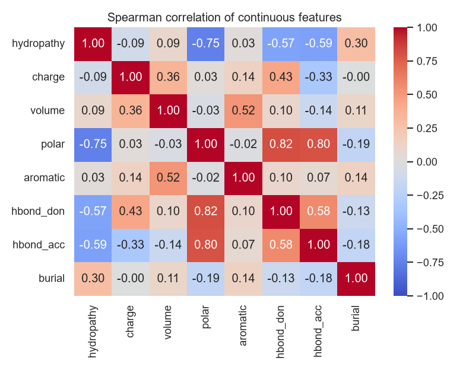
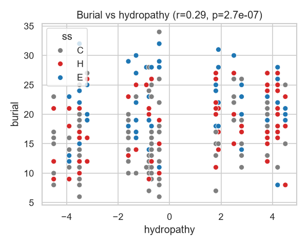
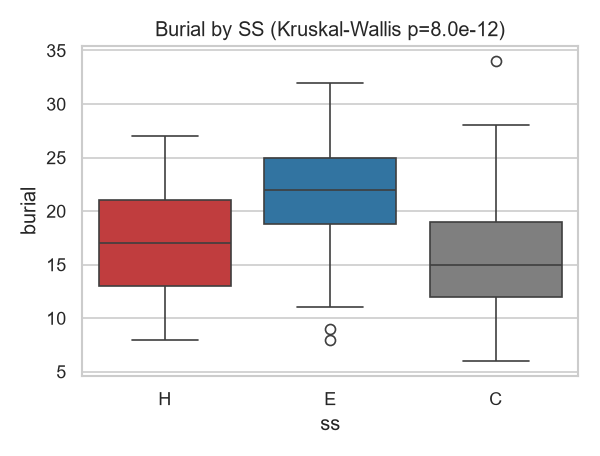
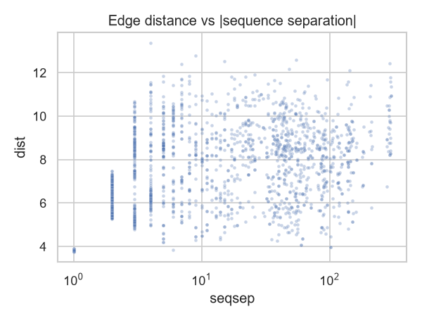
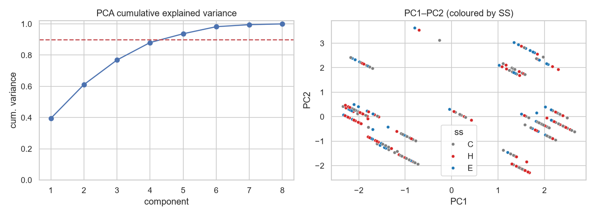
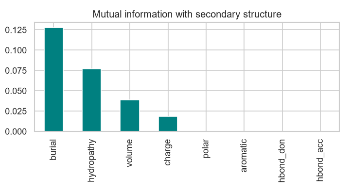

# Feature Analysis Report - 7rfw.pdb

## Step 0 - Dataset & data quality

**Observation.** 306 residues, 1 chain(s). Backbone angles defined for phi=305, psi=305, omega=305 residues; the rest are chain termini/gaps (0 break(s)). 140 hetero groups skipped.

**Decision.** Represent undefined angles with an explicit validity mask (already in the encoder) rather than imputing them.

**Significance.** Undefined dihedrals are structural facts, not missing data - masking prevents a generative model from learning fake angles at chain ends.

## Step 1 - Univariate: residue composition

**Observation.** 20 amino-acid vocabulary present; Shannon entropy 4.18 of 4.32 max bits (97% of uniform). Most common: L (29), rarest: W (3).

**Decision.** Keep a one-hot over the full 20 + UNK vocabulary; do not prune rare types.

**Significance.** Near-uniform composition means all classes carry signal; pruning would bias a generative model against rare-but-real residues.

## Step 2 - Univariate: continuous distributions

**Observation.** hydropathy skew=0.11, volume skew=-0.10, burial skew=0.24. Charge is discrete and sparse (mostly 0; 18% charged).

**Decision.** Standardise continuous features with fixed constants (done in encoder); leave binary/charge features raw.

**Significance.** Modest skew and differing scales (volume ~140 vs charge ~0) justify standardisation so no single feature dominates distance/gradient scales in a generative model.

## Step 3 - Univariate: backbone dihedrals

**Observation.** phi/psi are multimodal (helix and sheet basins); omega is sharply peaked near ±180 (100% of residues), i.e. trans peptide bonds.

**Decision.** Encode every angle as (sin, cos) rather than a raw degree value.

**Significance.** Angles are circular: −179° and +179° are neighbours. sin/cos removes the wrap-around discontinuity that would otherwise destabilise a generative model, and omega's tight peak shows it is nearly constant (low entropy).

## Step 4 - Univariate: secondary structure

**Observation.** SS mix (approx Ramachandran classifier): C=45%, E=27%, H=27%.

**Decision.** Keep 3-state SS as a one-hot node feature; flag DSSP as an optional upgrade for finer 8-state labels.

**Significance.** A realistic helix/sheet/coil balance confirms the coarse classifier is behaving; SS is a strong, low-dimensional structural prior for generation.

## Step 5 - Bivariate: feature correlation

**Observation.** Strongest redundancy: hbond_don–polar (|rho|=0.82). polar/hbond flags overlap with charge/hydropathy as expected.

**Decision.** Retain the correlated flags for interpretability but note the redundancy; an encoder could compress them.

**Significance.** Correlated hand-designed features are partially redundant - quantifying this tells us the *effective* feature dimensionality is below 8, guiding latent-size choices.

## Step 6 - Bivariate: burial vs hydropathy

**Observation.** Pearson r=0.29 (p=2.7e-07) between hydropathy and burial (coordination number).

**Decision.** Keep both features; the correlation is real but weak, so each still adds information.

**Significance.** A positive hydrophobic-core signal (hydrophobic residues tend to be more buried) is exactly the biophysics a structure generator must respect - the features encode it, which validates the design.

## Step 7 - Bivariate: burial vs secondary structure

**Observation.** Burial differs across SS classes (Kruskal-Wallis H=51.1, p=8.0e-12); sheets/helices are typically more buried than coil.

**Decision.** Keep burial and SS as complementary features rather than dropping either.

**Significance.** Statistically significant SS-burial coupling means the feature set jointly captures local structure and 3D environment - richer than either alone.

## Step 8 - Bivariate: residue type vs SS

| restype   |   C |   E |   H |
|:----------|----:|----:|----:|
| A         |   7 |   4 |   6 |
| C         |   4 |   5 |   3 |
| D         |   9 |   1 |   7 |
| E         |   5 |   1 |   3 |
| F         |   9 |   6 |   2 |
| G         |  18 |   5 |   3 |
| H         |   1 |   3 |   3 |
| I         |   4 |   3 |   4 |
| K         |   4 |   4 |   3 |
| L         |   9 |   8 |  12 |
| M         |   3 |   4 |   3 |
| N         |  13 |   2 |   6 |
| P         |   9 |   2 |   2 |
| Q         |   5 |   5 |   4 |
| R         |   8 |   0 |   3 |
| S         |   8 |   5 |   3 |
| T         |  16 |   6 |   2 |
| V         |   4 |  13 |  10 |
| W         |   1 |   1 |   1 |
| Y         |   2 |   6 |   3 |

**Observation.** Residue-type x SS contingency: chi2=58, dof=38, p=1.9e-02. Certain residues show clear helix/sheet preference.

**Decision.** No change needed - the one-hot residue type already lets a model learn these propensities.

**Significance.** Significant association confirms residue identity carries secondary-structure information (e.g. Gly/Pro breakers, beta-branched sheet formers), a key prior for sequence-conditioned structure generation.

## Step 9 - Bivariate: edge geometry vs sequence

**Observation.** 40% of kNN edges connect residues within 4 positions in sequence; the rest are long-range spatial contacts at similar distances.

**Decision.** Keep both the RBF distance and the (signed, log) sequence separation as edge features.

**Significance.** The graph captures contacts that sequence alone misses - long-range tertiary contacts - which is exactly the information a structure-based representation must add over a sequence-only model.

## Step 10 - Multivariate: PCA

**Observation.** 5 of 8 principal components explain 90% of variance (PC1=39%, PC2=22%).

**Decision.** Treat ~5 as the effective continuous-feature dimensionality; a generative latent need not exceed the graph/one-hot capacity by much.

**Significance.** Confirms the hand-designed continuous features are compressible - useful for setting encoder/latent widths and for spotting redundancy.

## Step 11 - Multivariate: clustering vs SS

**Observation.** KMeans(k=3) on the standardized continuous features vs the SS labels gives adjusted Rand index 0.00 (0 = chance).

**Decision.** Do not expect unsupervised clusters of physicochemistry/burial to recover SS; keep SS and dihedral angles as explicit, dedicated features.

**Significance.** A near-zero ARI is an important negative result: physicochemical and burial features alone carry almost no secondary-structure signal, so the backbone-dihedral and SS features are not redundant - they contribute information nothing else does, justifying their inclusion.

## Step 12 - Multivariate: multicollinearity (VIF)

|            |   VIF |
|:-----------|------:|
| hbond_don  | 11.56 |
| polar      | 10.58 |
| hbond_acc  |  6.74 |
| charge     |  6.03 |
| hydropathy |  3.1  |
| volume     |  1.83 |
| aromatic   |  1.73 |
| burial     |  1.13 |

**Observation.** Variance-inflation factors: hbond_don=11.6, polar=10.6, hbond_acc=6.7, charge=6.0, hydropathy=3.1, volume=1.8, aromatic=1.7, burial=1.1.

**Decision.** Flag features with VIF>5 as redundant; keep for interpretability but consider dropping in a compact encoder.

**Significance.** Multicollinearity analysis tells us which hand-designed features are near-linear combinations of others - directly informing a leaner encoding.

## Step 13 - Feature: variance & sparsity

**Observation.** Sparsity (fraction zero): charge=82%, aromatic=88%, hbond_don=58%, hbond_acc=61%. Lowest-variance feature: aromatic (0.109).

**Decision.** Retain sparse binary flags - sparsity is informative (a charged residue is a strong signal), not noise.

**Significance.** Distinguishing 'sparse but informative' from 'near-constant / useless' prevents accidentally discarding rare high-signal features.

## Step 14 - Feature: discriminative power (MI)

**Observation.** Most SS-informative continuous features: burial (0.128), hydropathy (0.077); least: hbond_acc (0.000).

**Decision.** Prioritise high-MI features; keep low-MI ones only if cheap and interpretable.

**Significance.** Ranks features by how much structural signal they carry - evidence-based justification of the feature set rather than intuition alone.

## Step 15 - Feature: encoding audit

**Observation.** Node tensor (306, 41), range [-1.97, 2.38]. Residue one-hot rows sum to 1: True. Round-trip passed: True (coord err 0.0e+00 A, RBF dist err 1.8e-04 A).

**Decision.** Ship the encoding as-is; determinism and reversibility are verified.

**Significance.** Closes the loop: the analysed features are exactly the tensors a model would consume, and they are well-scaled, valid, and decodable.
